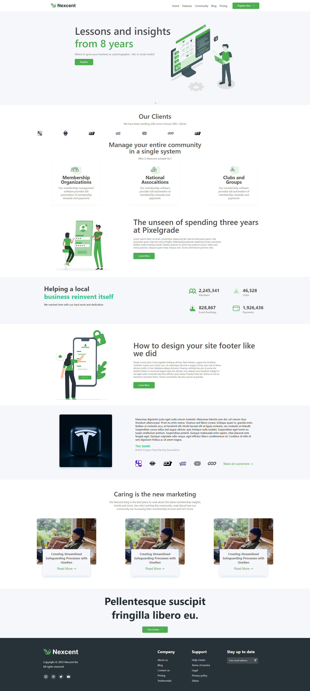

# 🖥️ Figma to Code: Landing Page (HTML + CSS)

This project is a fully responsive **Landing Page** meticulously converted from a **Figma design** to production-ready **HTML and CSS**.  
It reflects my ability to accurately interpret design specs, manage layout hierarchies, and write clean, maintainable code.

---

## 🔗 Live Demo & Design

- 🔴 **Live Project:** [View on GitHub Pages](https://yourusername.github.io/figma-landing-page/)  
- 🎨 **Figma Design:** [Open Figma File]([https://www.figma.com/file/your-file-link](https://www.figma.com/design/IXBBPDW90fgxFF5X7ST6m8/Responsive-Landing-Page-Design-%7C-Website-Home-Page-Design-%7C-Agency-Website-UI-Design--Community-?node-id=5-573&t=EOtChCIlHvzldIm6-0))

---

 <!-- Optional: Add a screenshot -->

---

## 🚀 Features

- 🎯 Pixel-perfect implementation from Figma
- 📱 Fully responsive layout across devices
- 🎨 Modern and clean UI with semantic HTML
- 📐 Flexbox and Grid layout techniques
- 🌐 Consistent typography, spacing, and component structure
- 💼 Perfect for portfolios, product pages, or business sites

---

## 🛠 Tech Stack

| Technology | Description                  |
|------------|------------------------------|
| HTML5      | Page structure and semantics |
| CSS3       | Styling and responsiveness   |
| Figma      | Design source and reference  |

---

## 📚 What I Learned

- Translating visual components from **Figma** into semantic HTML
- Using **developer tools in Figma** (like inspecting paddings, margins, typography)
- Managing layout with **Flexbox** and **CSS Grid**
- Applying a **mobile-first approach** with media queries
- Creating reusable styles and maintaining consistency
- Handling **spacing, alignment, and scaling** across viewports

---

## 🧩 Key Techniques & Concepts

| Concept                | Application in Project                       |
|------------------------|-----------------------------------------------|
| `flex` & `grid`        | Layout and component alignment               |
| `rem/em` units         | Scalable spacing and font sizing             |
| `media queries`        | Responsiveness for tablets and desktops      |
| `hover/focus states`   | Basic interactivity and UX feedback          |
| `font-family` & `weights` | Typography matching the Figma design     |

---

## 📁 Project Structure

```bash
figma-landing-page/
│
├── assets             # Project images
├── index.html         # Main landing page
├── style.css          # Full page styling and responsiveness
└── README.md          # Project documentation
